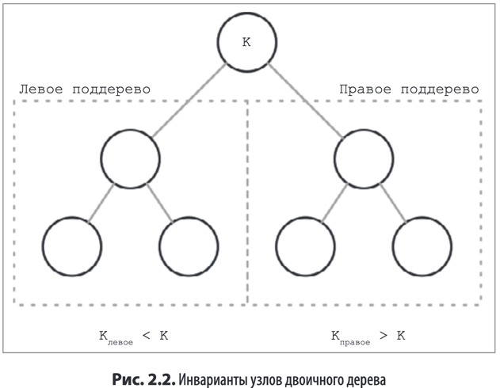
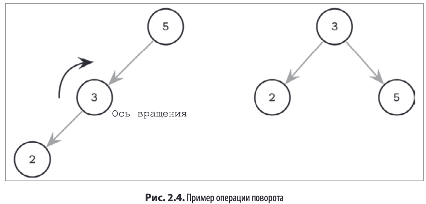

> Двоичное дерево поиска — это упорядоченная структура данных в оперативной
памяти, используемая для эффективного поиска значений по ключу. 

**_Сбалансированное_** дерево определяется как дерево, имеющее высоту log2N, где N —
общее число элементов в дереве, а разница в высоте между двумя поддеревьями не
превышает единицы. Без балансировки мы теряем преимущества произ-
водительности структуры двоичного дерева поиска и позволяем операциям вставки
и удаления определять форму дерева.

Если операция вставки оставляет
ветвь несбалансированной (два последовательных узла в ветви имеют только одного
потомка), мы можем повернуть узлы вокруг среднего узла.

Двоичные деревья имеют недостатки, которые сильно бьют по производительности в случае если мы используем их на диске
Из-за малого ветвления нет гарантий, что содержимое соседних элементов физически запишется на соседние блоки диска.
Из-за высоты дерева сильно возрастает количество операций чтения с диска