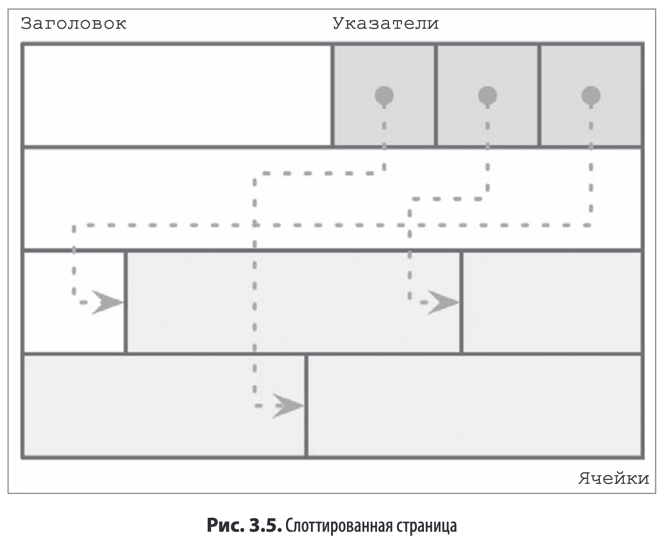
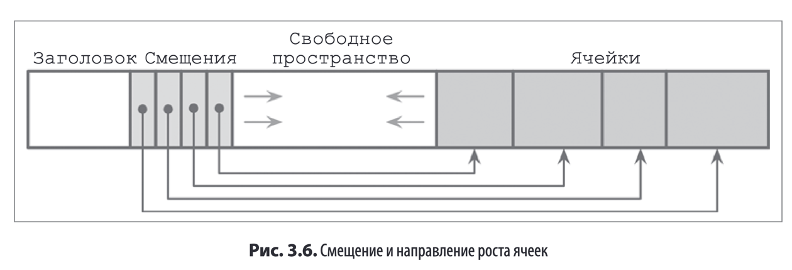

Для эффективного хранения данных на дисках необходимо скомпоновать данные

Строительными блоками являются примитивы (по аналогии с ЯП, например java/kotlin)

Для эффективного сохранения записей переменного размера, таких как строки, боль-
шие двоичные объекты и т. д., можно использовать такой способ организации, как
слоттированная страница (Например в Postgres)

Т.е указатели хранятся отдельно от ячеек с данными. Это позволяет сохранять организацию путем реорганизации указателей,
а удаление осуществлять через обнуления указателя

>Итого имеем схему:
Примитивы -> Ячейки -> Страницы -> Деревья

