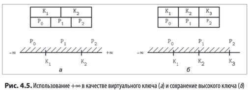

Каждая страница имеет заголовок, отдел сохраняющий некоторую мета-дату необходимую для оптимизации, обслуживание и поиска

Помимо прочего этот блок может содержать _**магическое число**_ - некоторое число считывание которого может дать понять, что страница загружена корректно.
(т.к вероятность случайного совпадения последовательности байт с числом минимальная)

Некоторые реализации хранят ссылки на левый и правый одноуровневые узлы дерева.
Еще одной оптимизацией является сохранение **_высокого ключа_** - максимального значения ключа в данном поддереве
Он позволяет значительно уменьшить пространство поиска

Размер узла и степень ветвления дерева фиксированы и не меняются динамически.
Алгоритмы B-дерева предполагают, что узлы имеют определенное количество элементов, но может случиться так, что
узел еще не заполнен до конца, но места на странице нет. Для решения этой проблемы существуют 
**_страницы переполнения_**. Чаще всего в непосредственно в узел пишется какой-то ограниченный объем, а остальное уходит
на страницы переполнения. Они в свою очередь хранят ссылки друг на друга (односвязный список)

В целях оптимизации при перестроении дерева БД сохраняет путь прохождения от корня до листа в т н **_навигационную цепочку_**
, которая хранит ссылки на пройденные узлы (по сути стек)

#### Заголовок страницы
* Какая информация обычно хранится в заголовке,
#### Крайние правые указатели
* Мы выяснили что они не сопряжены с ключами«разделителями+ и узнали+ как
с ними следует обращаться
#### Высокие ключи
* Указывают какой максимально допустимый ключ может быть сохранен в узле,
#### Страницы переполнения
* Позволяют сохранить записи слишком большого и переменного размера при
использовании страниц фиксированного размера,

Наконец мы познакомились с некоторыми методами оптимизации и обслуживания,
#### Перебалансировка
* Перемещает элементы между соседними узлами для уменьшения числа операций
разделения и слияния,
#### Добавление только справа
* Добавляет новую крайнюю правую ячейку &вместо того+ чтобы разбивать ячейку(
из расчета на то+ что она быстро заполнится,
#### Массовая загрузка
* Метод эффективного построения A«деревьев с нуля из отсортированных данных,
#### Сборка мусора
* Процесс который переписывает страницы+ сортирует ячейки в пор