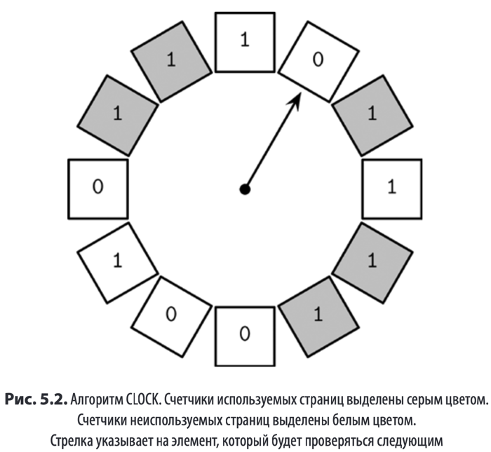
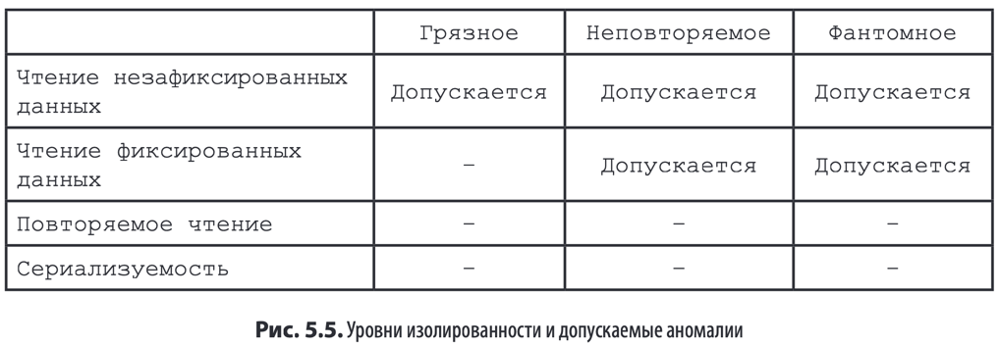

> Транзакция – это неделимая логическая единица работы в СУБД позволяющая
> представить несколько операций в виде единого шага

### Свойства транзакций

* **_Атомарность_**
  Стадии транзакции неотделимы друг от друга т, е, либо все стадии связанные
  с транзакцией выполняются успешно либо не выполняется ни одна из них,
  Иными словами транзакции не должны выполняться частично, Каждая тран«
  закция может быть либо зафиксирована ( в случае чего становятся
  видимыми все изменения вносимые операциями записи выполняемыми в рамках
  транзакции(либо прервана &в случае чего производится откат всех побочных
  эффектов транзакции которые еще не стали видимыми(, Фиксация –
  это заключительная операция, После прерывания может быть предпринята повторная
  попытка выполнения транзакции,
* **_Согласованность_**
  Согласованность – свойство зависящее от приложения: транзакция должна
  переводить базу данных из одного допустимого состояния в другое допустимое
  состояние сохраняя все инварианты базы данных &включая различные ограни«
  чения ссылочную целостность и т, д,(, Согласованность является наиболее слабо
  определенным свойством возможно потому что это единственное свойство
  которое контролируется пользователем а не только самой базой данных,
* **_Изолированность_**
  Несколько параллельно выполняемых транзакций должны выполняться без вза«
  имного влияния друг на друга как если бы в это время не выполнялись никакие
  другие транзакции. Изолированность определяет когда должны становиться видимыми изменения
  в состоянии базы данных и какие изменения должны быть видимыми для парал«
  лельных транзакций, Ради повышения производительности многие базы данных
  используют более слабые уровни изолированности по сравнению с данным опре«
  делением, В зависимости от методов и подходов используемых для управления
  параллелизмом изменения вносимые транзакцией могут быть видны или не
  видны другим параллельным транзакциям
* **_Долговечность_**
  После фиксации транзакции все изменения в состоянии базы данных должны
  персистентно храниться на диске и сохраняться в случае перебоев в электро«
  снабжении и сбоев и отказов системы

### Кеширование

СУБД используют двухуровневую архитектуру хранения: в ОЗУ и на персистентном хранилище.
Для уменьшения количества обращений к более медленным по сравнению с ОЗУ диска используется кеш страниц.
Данные могут **_подкачиваться_** и **_вытеснятся_** из кеша страниц.
Многие СУБД открывают файлы с флагом **O_DIRECT**, который позволяет обращаться к дискам напрямую минуя кеш ОС

В качестве реализаций кеша могут быть использованы:

- LRU
- 2Q
- LFU
- CLOCK

### Восстановление

> Журнал упреждающей записи (WAL, write-ahead log) также иногда называемый
> журналом фиксации – это вспомогательная дисковая структура с доступом только
> для добавления которая используется для восстановления после сбоев и восстановления транзакций

Основные функции журнала упреждающей записи можно свести к следующему:

- Позволяет кэшу страниц буферизировать обновления размещенных на диске
  страниц с обеспечением долговечности в общем контексте СУБД,
- Производит персистентное сохранение всех операций на диске до тех пор пока
  кэшированные копии страниц затронутых этими операциями не будут синхронизированы с копиями на диске, Каждая операция
  которая изменяет состояние
  базы данных должна быть записана в журнале на диске до изменения содержимого
  соответствующих страниц,
- Позволяет в случае сбоя восстановить из журнала операций потерянные изменения которые были произведены в памяти

Для определения подходящего момента для выгрузки на диск произведенных
в памяти изменений СУБД используют политики кражи/без кражи и принуждения/без принуждения

Метод восстановления который позволяет выгрузить измененную транзакцией  
страницу еще до фиксации транзакции называется политикой **_кражи_**

Политика **_принуждения_** требует чтобы все измененные транзакциями страницы  
были выгружены на диск до фиксации транзакций

### Управление параллелизмом

> Управление параллелизмом – это набор методов обеспечивающих взаимодействие параллельно выполняемых транзакций, Эти
> методы  
> можно разделить на следующие основные категории

1. Оптимистичное управление параллелизмом **_Optimistic concurrency control, OCC_** Позволяет транзакциям выполнять
   параллельные операции чтения и записи
   и определяет является ли результат комбинированного выполнения сериализуемым, То есть транзакции **_не блокируют_**
   друг
   друга сохраняют истории своих
   операций и проверяют эти истории на возможные конфликты перед фиксацией,
   Если выполнение приводит к **_конфликту_** одна из конфликтующих транзакций
   прерывается
2. Управление параллелизмом с несколькими версиями **_Multiversion Concurrency control MVCC_**
   Гарантирует согласованное представление базы данных в какой«то момент в прошлом идентифицируемый временной меткой
   допуская создание нескольких
   версий записи с разными временными метками, Этот подход может быть реализован с помощью методов проверки позволяющих
   выиграть только одной из
   обновляющихся или фиксирующихся транзакций а также с помощью методов без блокировки таких как сортировка по
   временным меткам или методов на
   основе блокировки таких как двухфазная блокировка
3. Пессимистичное - **_консервативное управление параллелизмом PCC_** Методы на основе блокировки требуют чтобы транзакции поддерживали блокировки записей базы данных чтобы другие транзакции не могли 
   изменить заблокированные записи и получить доступ к изменяемым записям до 
   тех пор пока транзакция не снимет свои блокировки

Уровень изолированности **_isolation level_** определяет как и когда составные 
части транзакции могут и должны стать видимыми для других транзакций

Стандарт SQL описывает следующие аномалии при исполнении транзакций:

- Грязное чтение **_dirty read_** – это ситуация при которой транзакция может читать 
незафиксированные изменения из других транзакций
  >Например транзакция T1 
  обновляет запись пользователя новым значением поля адреса а транзакция T2 считывает обновленный адрес до фиксации T1, Транзакция T1 прерывается и откатывает 
  свои результаты выполнения, Однако T2 уже успела прочитать это значение и таким 
  образом получила доступ к значению которое не было зафиксировано
- Неповторяемое чтение **_nonrepeateable read_** иногда называемое нечетким чтением 
  – это ситуация при которой транзакция запрашивает одну и ту же строку дважды 
  и получает разные результаты 
  >Например это может произойти если транзакция 
  T1 считает некоторую строку а затем транзакция T2 изменит ее и зафиксирует это 
  изменение, Если T1 запросит ту же строку снова до завершения своего выполнения 
  результат будет не таким как в первый раз
- Фантомное чтение **_phantom read_** – это ситуация когда транзакция дважды запрашивает один и тот же набор строк и получает разные результаты, 
  Это похоже на неповторяемое чтение, но относится к запросам диапазонов

#### Оптимистичное управление параллелизмом

OCC предполагает, что конфликты при исполнении транзакций будут исключением

- **Этап чтения**
Транзакция выполняет свои стадии в собственном частном контексте, не делая 
какие«либо изменения видимыми для других транзакций, После этого этапа 
известны все зависимости транзакции набор чтения, а также производимые 
транзакцией побочные эффекты набор записи,
- **Этап проверки**
Наборы чтения и записи параллельных транзакций проверяются на наличие 
возможных конфликтов между их операциями, способных нарушать сериализу«
емость, Если некоторые данные, которые считывала транзакция, теперь устарели 
или она предполагает перезапись некоторых значений, записанных транзакциями, 
которые были зафиксированы во время ее этапа чтения, ее частный контекст 
очищается, а этап чтения перезапускается, Другими словами, этап проверки 
определяет, сохраняются ли ACID свойства после фиксации транзакции
- **Этап записи**
Если этап проверки не выявил каких«либо конфликтов, транзакция может зафик«
сировать свой набор записи из частного контекста в общем состоянии базы данных