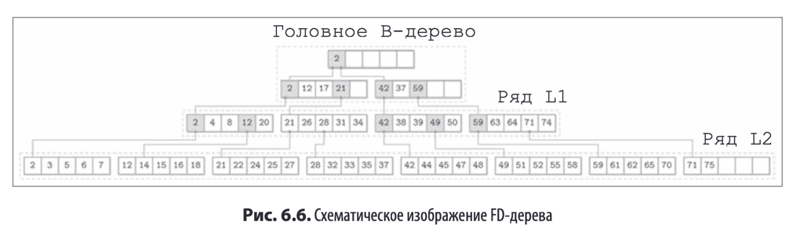
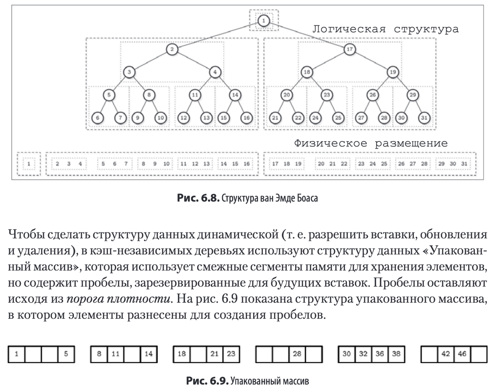

### Копирование при записи

Вместо реализации системы с блокировками некоторые СУБД используют идею копирования при записи,
т.е вместо изменения оригинального дереве создается копия под дерева для которой и происходят изменения.
Очевидным минусом здесь является необходимость в использовании **_дополнительной_** памяти, однако из-за небольшой
высоты
дерева этот недостаток компенсируется. Например, для подобного дерева **не нужно накладывать** блокировки на **_чтение_
**
, а помимо этого в случае сбоев при записи дерево все равно останется в консистентном состоянии

Примером БД с использованием такого подхода является **LMDB** (Lightning Memory-Mapped Database)

### Ленивые B-деревья

Еще одной из идей в реализации является **буферизация** обновлений **вместо немедленного применения** их к дереву.
Подобный подход используется в подсистеме хранения **WiredTiger** - базовой подсистеме для **MongoDB**

Основное преимущество здесь заключается в том, что обновления страниц и структурные модификации (разделения и слияния)
выполняются фоновым потоком
и процессы чтения.записи не должны ждать их завершения

Так же существует разновидность ленивых деревьев - LA(lazy adaptive)-деревья, которые буферизируют операции на уровне
поддерева

### FD-деревья

Альтернативный вариант это использование отдельного неизменяемого хранилища и использованием частичного каскадирования
для ускорения поиска

### Bw-деревья

Buzzword дерево предлагает концепцию с пакетным обновлением и хранением этих обновлений в отдельной структуре данных в
памяти

Существует понятие **базового** и **дельта**-узла (узла с изменениями). Дельта-узлы хранятся в связанном списке от
старых изменений к новым

Чтобы обновить узел дерева алгоритм выполняет следующие действия

1) Целевой логический листовой узел находится путем обхода дерева от корня
   к листу, Таблица отображения содержит виртуальные ссылки на целевые базовые
   узлы или последние дельта«узлы в цепочке обновлений,
2) Создается новый дельта«узел с указателем на базовый узел или на последний
   дельта-узел найденный в ходе шага 1,
3) Обновляется таблица отображения с добавлением в нее указателя на новый
   дельта-узел созданный в ходе шага 2

Операция обновления во время шага 2 может быть выполнена с помощью операции
"Сравнение с обменом" которая является атомарной поэтому все чтения параллельные
обновлению указателя ,разделяются на операции ,происходящие либо до ,либо после
записи ,без блокировки операций чтения и записи

Чтобы дельта-узлы не разрастались слишком сильно существует некоторое пороговое значение при котором происходит консолидация
дельт и создание нового узла.

### Кеш-независимое B-дерево

