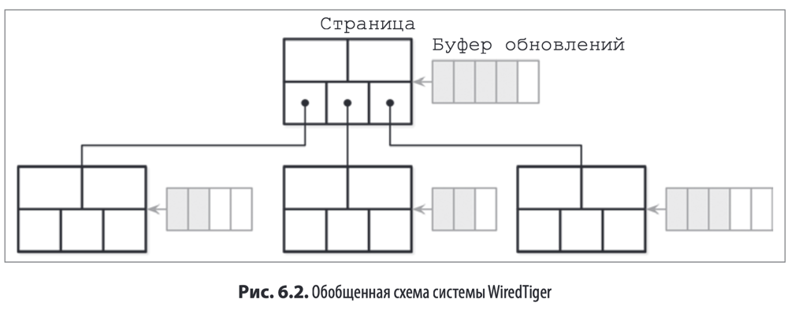

### Копирование при записи

Вместо реализации системы с блокировками некоторые СУБД используют идею копирования при записи,
т.е вместо изменения оригинального дереве создается копия под дерева для которой и происходят изменения.
Очевидным минусом здесь является необходимость в использовании **_дополнительной_** памяти, однако из-за небольшой
высоты
дерева этот недостаток компенсируется. Например, для подобного дерева **не нужно накладывать** блокировки на **_чтение_
**
, а помимо этого в случае сбоев при записи дерево все равно останется в консистентном состоянии

Примером БД с использованием такого подхода является **LMDB** (Lightning Memory-Mapped Database)

### Ленивые B-деревья

Еще одной из идей в реализации является **буферизация** обновлений **вместо немедленного применения** их к дереву.
Подобный подход используется в подсистеме хранения **WiredTiger** - базовой подсистеме для **MongoDB**

Основное преимущество здесь заключается в том, что обновления страниц и структурные модификации (разделения и слияния) выполняются фоновым потоком
и процессы чтения.записи не должны ждать их завершения