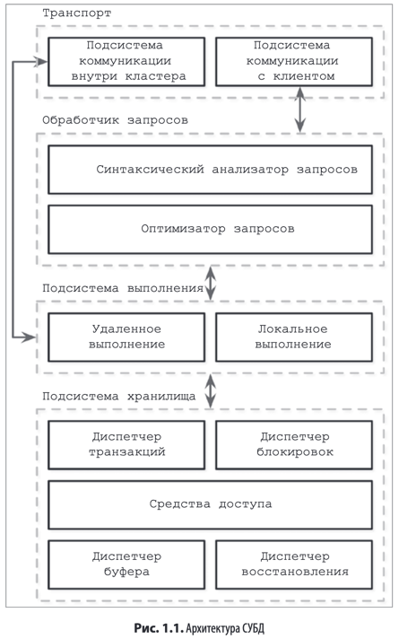

СУБД можно представить в виде системы состоящей из нескольких модулей.
В общем случае, можно выделить следующие модули:

1) Транспортный уровень, принимающий и отправляющий ответы на запросы
2) Обработчик запросов, предоставляющий наиболее эффективный план по выполнению запросов
3) Модуль выполнения запросов
4) Подсистема хранения данных

> Подсистема хранения данных (или `ядро` СУБД) — это программный компонент
СУБД, отвечающий за хранение, извлечение и управление данными в памяти и на
диске, предназначенный для работы с постоянной, долговременной памятью каждого
узла

При выборе БД будет полезно ответить на следующие вопросы:

- каковы размеры схемы данных и записей;
- каково количество клиентов;
- какие типы запросов и паттерны доступа;
- какая скорость выполнения запросов на чтение и запись;
- каковы ожидаемые изменения в любой из этих переменных

При выборе можно обращаться к сравнительному тестированию TPC-C
> TPC-C -  это тест обработки транзакций в реальном времени (Online Transaction
Processing, OLTP), представляющий собой смесь транзакций только для чтения и обновле-
ния, которые имитируют распространенные рабочие нагрузки приложений.

## Виды БД:

По физическому расположению данных:

1) Резидентные (in-memory)
> Не стоит думать, что резидентная база данных представляет собой что-то вроде
дисковой базы данных с огромным страничным кэшем (см. раздел «Организация
буферизации данных» на с. 98). При кэшировании страниц в памяти формат
сериализации и способ представления данных несут с собой дополнительные
издержки и не позволяют достичь той же степени оптимизации, которую могут
обеспечить резидентные хранилища.
2) Дисковые

### Поколоночные и строчные

**_Колоночные_** хранилища хорошо подходят для аналитической обработки, требую-
щей вычисления агрегатных величин, — для определения тенденций, вычислении
средних значений и т. д

Подход **_строчных_** бд же хорошо работает в тех случаях, когда запись состоит из нескольких полей
(имя, дата рождения и номер телефона) и однозначно идентифицируется ключом
Поскольку доступ к данным на персистентном носителе, таком как диск, обычно
осуществляется поблочно (другими словами, минимальная единица доступа к ди-
ску — это блок), один блок будет содержать данные для всех столбцов. Такой способ
отлично подходит для случаев, когда мы хотим получить доступ ко всей записи
пользователя, но делает более затратными обращения к отдельным полям нескольких
записей (например, запросы для получения только телефонных номеров), так как
данные из других полей также будут загружаться в кэш

При выборе между этими двумя типа БД стоит ориентироваться на паттерны доступа к данным.
Если мы обращаемся к данным точечно или смотрим на диапозоны, то строчные будут показывать себя лучше.
Если же дело идет с агрегацией данных, то выбирать стоит колоночные БД

### Хранилища с широкими столбцами

Данные представлены в виде многомерной карты, столбцы сгруппирова-
ны в семейства столбцов (обычно хранящие данные одного типа), а внутри каждого
семейства столбцов данные сохраняются построчно

Классический пример — Webtable

Данные сохраняются в многомерной отсортированной карте с иерархическими
индексами: мы можем найти данные, относящиеся к конкретной веб-странице, по ее
обращенному URL-адресу и ее содержимое или якоря — по временной метке. Каждая
строка индексируется своим ключом строки. Связанные столбцы группируются в се-
мейства столбцов (в данном случае — в семейства contents (содержимое) и anchor
(якорь)), которые сохраняются на диске по отдельности. Каждый столбец внутри
семейства идентифицируется с помощью ключа столбца, включающего в себя имя
семейства столбцов и квалификатор (в данном случае — html, cnnsi.com, my.look.ca).
Семейства столбцов хранят несколько версий данных согласно меткам времени.

### Файлы данных и индексные файлы

Для повышения эффективности при:

1) Чтении
2) Обновлении
3) Хранения

СУБД используют специальные структуры файлов. Отдельно можно говорить о **_файлах данных_** и **_индексных файлах_**

Файлы данных могут быть представлены в виде:

1) Таблицы-кучи, данные в которое хранятся не упорядочено, что убирает оверхед на запись, но требует дополнительной
структуры данных для поиска

2) Индексированной таблицы 

3) Хэшированной таблицы (хеш-мапа)