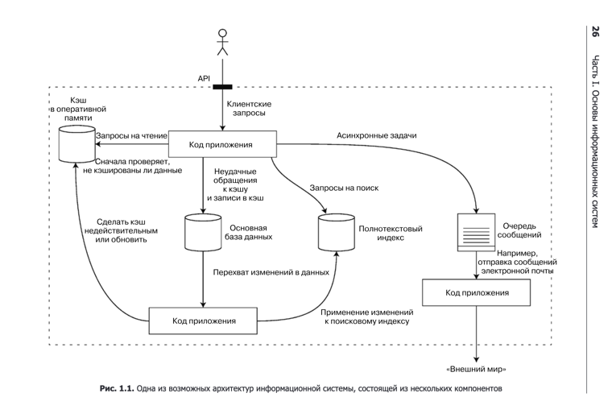

Исходя из специфики можно выделить приложения:
1) Compute-intensive (нагруженные вычислениями)
2) Data-intensive (нагруженные данными)

По существу Информационные системы представляют из себя совокупность связанных между собой других ИС.
Знание об особенностях их работы и взвешивание других факторов (опыт команды, законодательные издержки, сроки поставки) позволяет грамотно 
балансировать между ключевыми свойствами ИС

## Надежность 

---
> Система должна продолжать работать корректно (осуществлять
нужные функции на требуемом уровне производительности) даже при неблагоприятных обстоятельствах (в случае аппаратных или программных сбоев либо
ошибок пользователя)

От программного обеспечения обычно ожидается следующее

- приложение выполняет **_ожидаемую_** пользователем **_функцию_**;
- оно способно **_выдержать ошибочные действия_** пользователя или применение
программного обеспечения неожиданным образом;
- его **_производительность достаточно высока_** для текущего сценария использования, при предполагаемой нагрузке и объеме данных;
- система предотвращает любой **_несанкционированный доступ_** и ***неправильную
эксплуатацию***

Возможные проблемы называют **_сбоями_**. Ситуации же когда сервис полностью прекращает обслуживание пользователей называется **_отказ_**

Причины возникновения сбоев:

1) Аппаратные, возникающее при проблемах с `железом`
2) Программные, возникающее при ошибках в коде/проектировании системы
3) Человеческий фактор (кривой конфиг, запуск нерабочей миграции и тп)

## Масштабируемость

---
>  Должны быть предусмотрены разумные способы решения
возникающих при росте (в смысле объемов данных, трафика или сложности)
системы проблем
 
Для описания нагрузки можно использовать разные **_параметры нагрузки_**:
`rps`, количество `одновременно` работающих пользователей, процент успешных `попаданий` в кеш
Для каждой системы они будут свои

Как описывать производительность системы? 
> `latency` - время ожидания (т.е.) с момента запроса до начала обслуживания,
> `response time` - то, что видит клиент по сути полный цикл запрос-ответ

Но даже если повторять один и тот же запрос, то время ответа всегда будет отличаться, поэтому для грамотной оценки используют `процентили`

Процентили отражают для какого количества пользователей было такое время ответа.Например, то, что время отклика для 95-го процентиля
равно 1,5 с, означает следующее: 95 из 100 запросов занимают менее 1,5 с, а 5 из 100
занимают 1,5 с либо дольше

Процентили часто используются в требованиях к уровню предоставления сервиса (service level objectives, `SLO`) и соглашениях об уровне предоставления
сервиса (service level agreements, `SLA`) — контрактах, описывающих ожидаемые
производительность и доступность сервиса. В `SLA`, например, может быть указано:
сервис рассматривается как функционирующий нормально, если его медианное
время отклика менее 200 мс, а 99-й процентиль меньше 1 с (когда время отклика
больше, это равносильно неработающему сервису), причем в требованиях может
быть указано, что сервис должен работать нормально не менее 99,9 % времени

При анализе подходов к масштабированию зачастую проводят дифференциацию между **_вертикальным масштабированием_** —
переходом на более мощную машину — и **_горизонтальным масштабированием_** — распределением нагрузки по нескольким меньшим машинам

Хорошая масштабируемая для конкретного приложения архитектура базируется
на **_допущениях_** о том, какие операции будут выполняться часто, а какие — редко,
то есть на `параметрах нагрузки`. Обычно на начальных этапах развития продукта на первый план должна ставиться работа фич, а не масштабирование под гипотетическую нагрузку