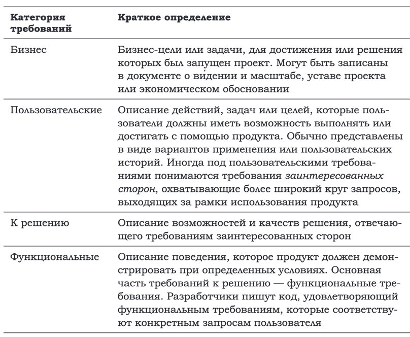
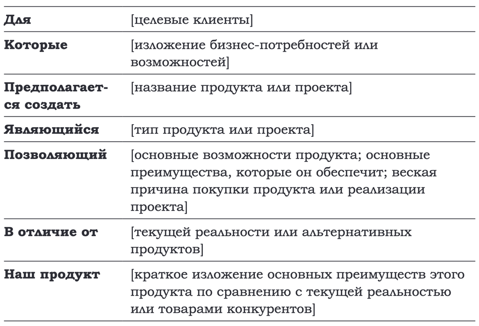

> **_Требование_** — это заявление о потребности или цели клиента либо
об условиях или возможностях, которыми должен обладать продукт, чтобы удовлетворить такую потребность или цель. Свойство,
которым должен обладать продукт, чтобы представлять ценность
для клиента

Если вы неверно определили требования, то неважно,
насколько хорошо вы выполните остальную часть работы.

Так помимо требований важно чтобы все участники проекта должны иметь общее **_видение_**
Для примера, можно описывать подробный документ перед началом работы

> Для читателей, которые интересуются книгой «Жемчуг из песчинок»,
предполагается создать сайт PearlsFromSand.com, позволяющий
посетителям получить информацию о книге и ее авторе, приоб-
рести копии в различных форматах и создать сообщество людей,
заинтересованных в обмене своим жизненным опытом. В отличие
от сайтов, которые просто описывают и рекламируют книгу, наш
продукт — PearlsFromSand.com — позволит посетителям делиться
своим жизненным опытом, а также читать и комментировать со-
общения друг друга