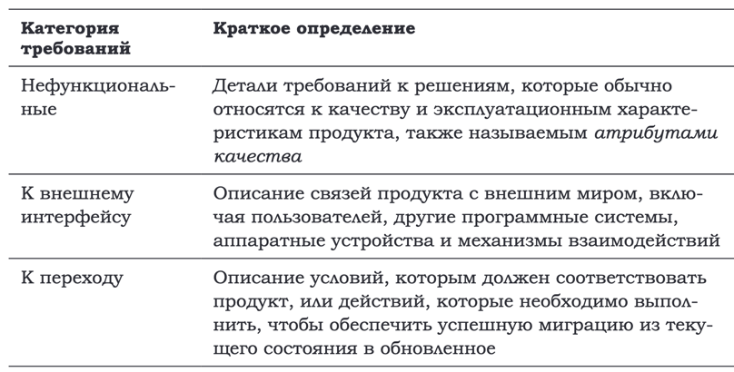

> **_Требование_** — это заявление о потребности или цели клиента либо
об условиях или возможностях, которыми должен обладать продукт, чтобы удовлетворить такую потребность или цель. Свойство,
которым должен обладать продукт, чтобы представлять ценность
для клиента

Если вы неверно определили требования, то неважно,
насколько хорошо вы выполните остальную часть работы.